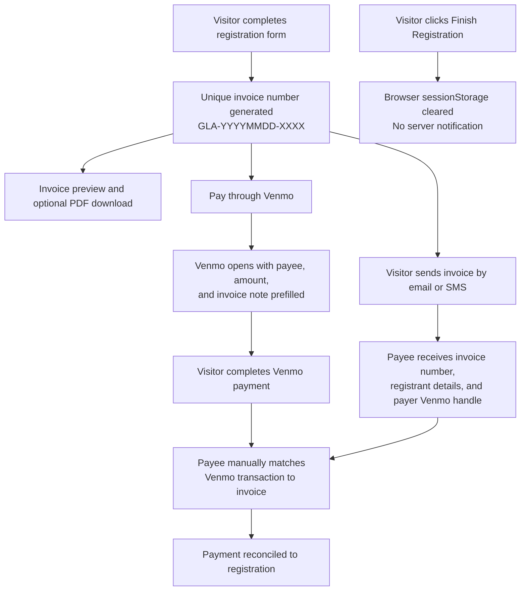

# GreatLakesAmateur - FlexNet JSX Architecture

This repository is a static replication of [michiganplayersgolfclub.com](https://www.michiganplayersgolfclub.com/) converted into a FlexNet JSX architecture for the Michigan Players Golf Club and Great Lakes Amateur tournament site.

FlexNet JSX was created by `@KitBaroness`. Questions about the FlexNet architecture can be commented to her.

## Architecture

This project intentionally uses:

- FlexNet JSX architecture
- Pure vanilla browser JavaScript with **ES modules** (`type="module"` entry in `index.html`)
- Functional JavaScript patterns with immutable config and pure helper functions
- No Node production runtime
- No Node build step
- No Tailwind CSS
- No frontend package dependency
- BEM CSS in `css/styles.css`
- Browser-native routing with `fetch()`, `DOMParser`, and hash routes
- Static HTML view fragments in `public/views/`
- Leaflet `1.9.4` and jsPDF `2.5.1` lazy-loaded from CDNs only when a route needs them

The `example/` folder is reference material for FlexNet JSX architecture only. Do not edit `example/` when changing this site.

## Runtime Router And Load Strategy

FlexNet Runtime Router keeps the application in one static HTML shell and loads only the requested page fragment from `public/views/`. The header, footer, config, router, and BEM stylesheet stay consistent across routes, which reduces repeated page setup work compared with loading a separate full HTML document for every page.

This approach improves load behavior across mobile, tablet, and desktop devices because:

- The browser loads one shared shell, one shared runtime, and one shared BEM stylesheet.
- Route changes fetch only the view fragment needed for the current page.
- Shared layout rendering stays centralized, reducing duplicated markup and timing drift between pages.
- BEM CSS keeps component styling predictable across browsers and operating systems.
- Legacy top-level URLs redirect into the same runtime path, preventing fragmented page behavior.

The result is a more consistent experience across device sizes, operating systems, and browsers while preserving a static deployment model.

## Deployment

The site is deployed through **Cloudflare Pages** from the GitHub repository. There is no build step: the repo root is the publish directory.

Static files that affect production behavior outside the FlexNet runtime:

| File | Purpose |
|------|---------|
| `_headers` | Security headers, Content Security Policy, and cache rules |
| `_redirects` | 301 redirects from legacy flat URLs into hash routes |
| `robots.txt` | Crawler allow rules and sitemap discovery |
| `sitemap.xml` | Indexable URL list for search engines |

## SEO And Discoverability

Search and social metadata are split across static files and runtime updates because there is no build step.

### What crawlers see

- **`index.html`** carries the primary SEO payload: canonical URL, robots directives, Open Graph and Twitter Card tags, favicons, early hero AVIF preload, and JSON-LD structured data (`SportsOrganization`, `WebSite`, `GolfCourse`, `SportsEvent`).
- **`src/core/site-config.js`** defines per-route `title` and `description` values plus a shared `seo` object (`siteUrl`, `siteName`, `ogImage`, Twitter handle, theme color).
- **`src/utilities/router.js`** updates `document.title`, the meta description, and Open Graph / Twitter tags when visitors navigate between routes.
- **View fragments** under `public/views/` use one `h1` per page, descriptive image `alt` text, and explicit `width` / `height` on images to reduce layout shift.

### Hash routing and indexing limits

Routes use hash paths such as `#/event-details`. Search engines discard the fragment, so crawlers resolve every route to the site root. That means:

- The canonical tag in `index.html` correctly points to `https://www.michiganplayersgolfclub.com/`.
- `sitemap.xml` intentionally lists only the root URL until routing moves to real paths (History API + Cloudflare SPA rewrite).
- Social sharing still works: `buildShareUrl()` in `router.js` emits deep links like `https://www.michiganplayersgolfclub.com/#/register` for `og:url`.

### Cloudflare robots.txt

Cloudflare's managed robots.txt **prepends** AI-crawler rules to an existing `robots.txt`; it does not replace the repo file. Keep `robots.txt` in the repository so the `Sitemap:` directive is preserved. Cloudflare only merges with a file it can fetch with HTTP 200 at `/robots.txt`.

If you want AI assistants to cite tournament content, review **AI crawlers** in the Cloudflare dashboard. Default zone settings may block GPTBot, ClaudeBot, and similar crawlers at the edge regardless of your `robots.txt`.

### Legacy URL redirects

The old flat pages (`contact.html`, `event-details.html`, `upcoming-events.html`, `sponsorship.html`) are thin redirect shells with `noindex` and a root canonical. Cloudflare Pages applies `_redirects` with 301 rules for both `.html` and extension-less paths (Pages rewrites `/page.html` to `/page`). Meta refresh inside each shell remains as a fallback for hosts that ignore `_redirects`.

### SEO assets

| Asset | Location | Notes |
|-------|----------|-------|
| Social preview image | `assets/images/og-image.jpg` | 1200×630; referenced in `index.html` and `sitemap.xml` |
| Favicon | `assets/images/favicon.ico` | 32×32 |
| Apple touch icon | `assets/images/favicon-180.png` | 180×180 |

### Updating the live domain

There is no templating step, so the production domain is duplicated in several places. Before launch or a domain change, search the repo for `michiganplayersgolfclub.com` and update:

- `src/core/site-config.js` → `seo.siteUrl`
- `index.html` → canonical, Open Graph, Twitter, and JSON-LD URLs
- `robots.txt` → `Sitemap:` line
- `sitemap.xml` → `<loc>` and image URLs
- Legacy redirect shells → `link rel="canonical"`

## Performance

The site targets fast first paint on mobile networks without a Node build step.

### Load strategy

- **Route view code splitting**: `src/utilities/routeViewModules.js` dynamically imports registration, map, and sponsorship modules only when their route is visited (or when cleanup is needed after leaving).
- **Versioned view fetches**: The router requests `public/views/...?v=<config.version>` so repeat visits can reuse cached fragments from the browser or Cloudflare CDN.
- **Idle prefetch**: From the home route, likely next pages (`#/event-details`, `#/register`) are prefetched during browser idle time.
- **Route-aware hero preload**: `index.html` preloads the home hero AVIF for first paint; `router.js` re-applies preload when visitors return to `#/home`.
- **Deferred map connections**: Leaflet CDN `preconnect` hints are injected when the contact map initializes, not on every page load.
- **Lazy map boot**: The contact map waits for viewport intersection before loading Leaflet and tiles.

### Images

Modern formats are served with JPEG fallbacks through `<picture>`:

| Asset | Formats | Notes |
|-------|---------|-------|
| Home hero | AVIF, WebP, JPEG | `430w` and `860w` srcset; ~19 KiB AVIF at display size |
| Home sidebar | WebP, JPEG | Lazy-loaded; hidden on small screens |
| Header logo | WebP, JPEG | 200px WebP variant for the fixed header |
| Upcoming events hero | WebP, JPEG | Featured tournament card |

Bump `config.version` in `src/core/site-config.js` when **view fragments** change. Also update `css/styles.css?v=` and `loader.js?v=` in `index.html` when static assets must invalidate immediately. `_headers` gives `/assets/*` a 7-day immutable cache, `/css/*` and `/src/*` a 24-hour cache, and HTML shells `no-store`.

## Security Caveats

This is a static frontend site. Static delivery reduces server-side attack surface because there is no Node production runtime, database session, or application server running inside this repository.

Security boundaries still matter:

- Do not store payment provider secrets, email API keys, private tokens, or credentials in frontend JavaScript.
- `mailto:`, `sms:`, and `tel:` links open the visitor's local apps; they do not securely submit private data to a server.
- Registration and sponsorship payments use the client-side invoice + Venmo workflow on `#/register`. There is no embedded legacy Wix checkout and no server-side payment capture in this repository.
- The contact page provides call, text, email, and map actions. It does not include a server-side contact form.
- The contact map loads Leaflet JavaScript and CSS from `unpkg.com` or `cdn.jsdelivr.net`, and map tiles from OpenStreetMap, so visitors' browsers make third-party map requests when the contact route is viewed.
- CDN scripts and stylesheets loaded by the runtime use Subresource Integrity hashes defined in `src/core/site-config.js`.
- `_headers` applies a Content Security Policy, `nosniff`, referrer policy, permissions policy, and cache rules for Cloudflare Pages.
- Any future automatic email delivery or hosted checkout should use a secure backend endpoint such as a Cloudflare Pages Function with environment variables.
- Any server-side endpoint should validate inputs, rate limit submissions, avoid exposing secrets, and return only the minimum response data needed by the browser.

## Session Privacy And Cache Controls

The site is designed to minimize leftover visitor-entered data after a session:

- The registration form uses `autocomplete="off"` on `#/register`.
- The FlexNet loader clears transient form fields on `pagehide` and `beforeunload`.
- The FlexNet loader clears app-owned `localStorage` and `sessionStorage` keys that use the `flexnet:` prefix, except the registration draft key used for the multi-step register flow.
- Registration draft data is stored in `sessionStorage` under `flexnet:registration:draft` so users can move through Details → Invoice & Venmo → Send without losing progress. Clear it by completing registration or closing the browser tab/session.
- Cloudflare Pages cache rules in `_headers` mark HTML shells as `no-store`, view fragments as cacheable with versioned fetch URLs, and runtime JavaScript for revalidation on each deploy.
- Static images and CSS may still be cached because they do not contain visitor-entered data.

Browser-controlled HTTP cache, mail client drafts, SMS drafts, autofill systems, and operating-system level caches cannot be fully erased by frontend JavaScript. Sensitive workflows that require guaranteed data disposal should be handled by a secure backend endpoint with explicit retention controls.

## Functional Structure

- `src/core/site-config.js`: Frozen site data exported as an ES module (`export default SiteConfig`). No global `window` config object.
- `src/core/loader.js`: ES module bootstrap and browser side effects.
- `src/core/layout/renderHeader.js`: Pure header rendering with escaped config output.
- `src/core/layout/renderFooter.js`: Pure footer rendering with escaped config output.
- `src/utilities/router.js`: Browser-native hash router, view loader, prefetch, and per-route SEO metadata updates.
- `src/utilities/routeViewModules.js`: Lazy dynamic imports for route-specific view modules.
- `src/utilities/escapeHtml.js`: Shared HTML escaping helper for markup builders.
- `src/utilities/loadCdnAsset.js`: Lazy CDN loader with Subresource Integrity support.
- `src/views/registration-invoice/registration-invoice.js`: Register flow, invoice generation, Venmo handoff, PDF download.
- `src/views/location-map/location-map.js`: Contact-page Leaflet map and hotel list.
- `src/views/sponsorship-showcase/sponsorship-showcase.js`: Sponsorship logo carousel and testimonials.
- `public/views/`: Static page fragments loaded by the router.
- `css/styles.css`: BEM component styling only.

## Design System

The visual theme is tuned for a professional amateur golf event in Great Lakes Michigan:

- Lake blue for structure and primary page headers
- Fairway green for actions and tournament emphasis
- Mist, sand, and white surfaces for clean readability
- Muted gold accents for sponsorship and premium tournament details
- Responsive BEM layouts for desktop, tablet, and mobile breakpoints

## Pages

| Route | View | Description |
|------|------|-------------|
| `#/home` | `public/views/home/index.html` | Home page with tournament hero, dates, and highlighted entry fee |
| `#/event-details` | `public/views/event-details/index.html` | Tournament details, schedule, prizes, course info, entry fee, and scoring link |
| `#/register` | `public/views/register/index.html` | Multi-step registration, invoice, Venmo payment, and email/SMS invoice send |
| `#/contact` | `public/views/contact/index.html` | Call/text/email actions and Leaflet map for Eagle Crest plus nearby hotels |
| `#/upcoming-events` | `public/views/upcoming-events/index.html` | Upcoming events listing |
| `#/sponsorship` | `public/views/sponsorship/index.html` | Sponsorship tiers, partner carousel, testimonials, and register links |

The old top-level URLs (`contact.html`, `event-details.html`, `upcoming-events.html`, `sponsorship.html`) redirect into the FlexNet SPA via `_redirects` on Cloudflare Pages.

## Local Preview

Run the FlexNet dev server from the repo root (gzip + cache headers):

```bash
python3 scripts/serve.py --port 8080
```

Plain `python3 -m http.server` works but omits compression and cache headers, so Lighthouse will report worse cache and transfer scores locally. Cloudflare Pages adds HTTP/2, Brotli, and edge caching in production.

Then visit:

```text
http://localhost:8080/index.html#/home
```

Note: Content Security Policy headers in `_headers` apply on Cloudflare Pages. Use `scripts/serve.py` locally for cache behavior; CSP still applies only on Cloudflare unless configured separately.

## Payments And Contact

Payment and contact behavior is centralized in `src/core/site-config.js`.

- Entry fee and sponsorship tiers route to `#/register` with the selected fee type.
- Registration creates an invoice number, opens Venmo with the invoice note, and lets the visitor send the invoice by email or SMS.
- Legacy Wix checkout is not embedded in this site.
- Call/text/email: mobile-friendly `tel:`, `sms:`, and prefilled `mailto:` links are generated from config.

For automatic invoice email delivery or hosted checkout, add a backend endpoint such as a Cloudflare Pages Function with an email provider API key.

### Registration and Venmo reconciliation flow

The `#/register` route is a **client-side, manual reconciliation** workflow. A unique invoice number links the form, the Venmo payment, and the email or SMS the payee receives. The payee (configured in `registration.payeeName` and `payments.venmoRecipient`) matches incoming Venmo transactions to invoices by hand.



Traceability depends on three shared fields:

| Field | Where it appears |
|-------|------------------|
| Invoice number | Venmo payment note, invoice preview/PDF, email subject, SMS body |
| Payer Venmo handle | Registration form (required), invoice text, SMS summary |
| Fee amount and type | Venmo amount prefill, invoice line items |

### What this flow does not do

This is not a backend payment system. Important limits:

- **No server receives the form.** Data lives in the browser until the visitor sends email/SMS or downloads a PDF.
- **Venmo note prefill is not guaranteed.** Venmo sometimes ignores or strips prefilled notes from deep links, especially on mobile. The invoice UI shows the note to include, but the visitor may need to type it manually.
- **Nothing is sent automatically.** “Email Invoice to the payee” opens a `mailto:` link; “SMS” opens `sms:`; the visitor must actually send the message.
- **“Finish Registration” only clears local storage** and shows a confirmation. It does not notify the payee or confirm payment on its own.
- **The payment checkbox is self-reported** and included in the invoice text only; it does not verify Venmo payment.

For guaranteed submission records or payment confirmation, add a secure backend endpoint (for example a Cloudflare Pages Function) that stores the draft when the invoice is created or when the visitor completes the flow.

## Customization Notes

- **Navigation and route metadata**: Edit `navigation` titles and descriptions in `src/core/site-config.js`.
- **SEO defaults**: Edit the `seo` object in `src/core/site-config.js` for `siteUrl`, social image path, and Twitter handle.
- **Structured data and social tags in search previews**: Edit the JSON-LD block and static Open Graph tags in `index.html`.
- **Sitemap and robots**: Edit `sitemap.xml` and `robots.txt` at the repo root.
- **Legacy redirects**: Edit `_redirects` and the matching top-level `.html` shells.
- **Page content**: Edit the matching file under `public/views/`.
- **Shared layout**: Edit `src/core/layout/renderHeader.js` or `src/core/layout/renderFooter.js`.
- **Styles**: Edit BEM components in `css/styles.css`.
- **Payments and registration fees**: Edit the `payments` and `registration` objects in `src/core/site-config.js`.
- **Contact actions**: Edit the `contact` object in `src/core/site-config.js`.
- **Contact map and hotels**: Edit the `locationMap` object in `src/core/site-config.js`.
- **CDN integrity hashes**: Update `locationMap` and `registration.jspdf` in `src/core/site-config.js` if CDN asset versions change.
- **Console easter egg**: Edit the `developerSignature` object in `src/core/site-config.js`.

## Best Practices

FlexNet conventions this repository follows:

### Architecture

- **Pure vanilla JS** with immutable config (`Object.freeze` / `Object.seal`) and `@pure` / `@effect` JSDoc on functions.
- **ES module runtime** — one `type="module"` entry (`src/core/loader.js`); config and views import through `import` / `export`, not globals.
- **No build step** — the repo root is the Cloudflare Pages publish directory.
- **BEM CSS only** in `css/styles.css`; no Tailwind or CSS-in-JS.
- **Hash SPA shell** — `index.html` inlines the default home route for first-paint LCP; other routes load from `public/views/`.
- **Lazy route modules** — registration, map, and sponsorship code split through `src/utilities/routeViewModules.js`.

### Security

- Escape all config-driven HTML through `src/utilities/escapeHtml.js`.
- Load CDN scripts and styles with Subresource Integrity via `src/utilities/loadCdnAsset.js`.
- Keep secrets out of the frontend; use Cloudflare Pages Functions for any future server endpoints.
- Review `_headers` CSP when adding new third-party origins.

### Accessibility

- One `h1` per view fragment; page title updates through the router.
- Skip link in `index.html` targets `#app` (focused on route change).
- Mobile menu toggle updates `aria-expanded` and `aria-label` (`Open menu` / `Close menu`).
- Registration validation errors use `role="alert"`; steps use `aria-current="step"`.
- Sponsor carousel announces slide changes through a visually hidden live region.

### Performance

- Serve modern image formats with JPEG fallbacks (`<picture>`) and width-based `srcset` for the home hero.
- Inline the default home route in `index.html` so the LCP image is in the first HTML document.
- Preload responsive hero AVIF from `index.html`; defer Leaflet CDN hints until contact map init.
- Version view fetches with `config.version`; bump `css/styles.css?v=` and `loader.js?v=` when static assets must invalidate immediately.

### Local verification

```bash
python3 scripts/serve.py --port 7002
./scripts/check.sh http://127.0.0.1:7002
```

Keep `public/views/home/index.html` in sync with the home markup embedded in `index.html` when editing the hero.

## Source

Replicated from the live Wix site on August 3, 2026, then converted into a FlexNet JSX vanilla JavaScript architecture.
